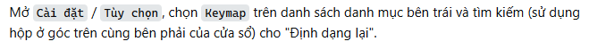

# Khắc phục các thẻ `<code>`, `<kbd>` hiển thị sai khi sử dụng Edge translator

VI | [EN](README_en.md)

## Mô tả vấn đề

Khi sử dụng tính năng dịch tự động của Microsoft Edge, các thẻ HTML như `<code>` và `<kbd>` gặp vấn đề:

**Bị thay đổi vị trí**: Sau khi dịch trang, các thẻ `<code>` và `<kbd>` hiển thị sai vị trí, dẫn đến việc hiển thị không
đúng như mong muốn.

👇👇👇

## Giải pháp của mã

Để khắc phục vấn đề này, mã JavaScript này được sử dụng để thay thế các thẻ `<code>` và `<kbd>` bằng thẻ `` khi
tính năng dịch của trình duyệt được kích hoạt. Cách thức hoạt động của mã như sau:

1. **Phát hiện dịch trang**: Mã sử dụng `MutationObserver` để giám sát thuộc tính `_msttexthash` trên thẻ `<title>`. Đây
   là thuộc tính mà trình duyệt thường thêm vào khi bắt đầu quá trình dịch. Khi phát hiện thay đổi, mã sẽ kích hoạt quá
   trình thay thế.

2. **Thay thế các thẻ `<code>` và `<kbd>` bằng ``**: Sau khi phát hiện, mã sẽ thay thế các thẻ `<code>` và `<kbd>`
   bằng ``. Chỉ sao chép các thuộc tính CSS quan trọng như `font`, `color`, `background-color`, `border`,
   `padding`, và `margin` từ thẻ gốc để giữ nguyên giao diện ban đầu.

3. **Tự động ngừng giám sát khi kết thúc**: Mã sẽ tự động ngừng giám sát khi quá trình dịch trang kết thúc, giúp giảm
   tải cho trình duyệt và tối ưu hiệu năng.

## Tham khảo

- Mã được tham khảo từ: [EdgeTranslator-CodeTag-BugFix](https://github.com/yqs112358/EdgeTranslator-CodeTag-BugFix)

## Cách sử dụng

1. Truy cập `edge://extensions/`.
2. Bật **Chế độ nhà phát triển** (Developer mode).
3. Nhấn vào **Tải tiện ích đã giải nén** (Load unpacked) và chọn thư mục chứa Extension.
