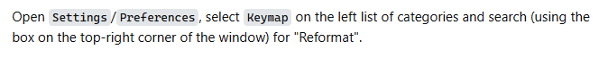
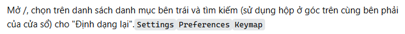
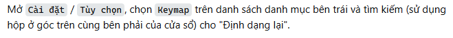

# Fixing Display Issues for `<code>`, `<kbd>` Tags with Microsoft Edge Translator

EN | [VI](README.md)

## Problem Description

When using the automatic translation feature of Microsoft Edge, HTML tags such as `<code>` and `<kbd>` encounter display
issues:

- **Misalignment**: After translation, `<code>` and `<kbd>` tags may appear out of position, leading to unintended
  display and layout changes.

👇👇👇

## Solution Overview

This JavaScript code addresses the problem by replacing `<code>` and `<kbd>` tags with `` elements when the
browser’s translation feature is active. The code functions as follows:

1. **Detecting Page Translation**: The code uses `MutationObserver` to monitor the `_msttexthash` attribute on the
   `<title>` tag, which Edge typically adds at the start of a translation. When a change is detected, the replacement
   process is triggered.

2. **Replacing `<code>` and `<kbd>` Tags with ``**: Once translation is detected, the code replaces `<code>` and
   `<kbd>` tags with `` elements, copying only essential CSS attributes such as `font`, `color`,
   `background-color`, `border`, `padding`, and `margin` from the original tags to maintain the initial appearance.

3. **Automatic Monitoring Stop After Completion**: The code automatically stops monitoring once the translation process
   ends, reducing browser load and improving performance.

## Reference

- Code reference: [EdgeTranslator-CodeTag-BugFix](https://github.com/yqs112358/EdgeTranslator-CodeTag-BugFix)

## Usage Instructions

To use this solution as a developer extension in Edge:

1. Open `edge://extensions/`.
2. Enable **Developer mode**.
3. Click **Load unpacked** and select the folder containing the extension files.